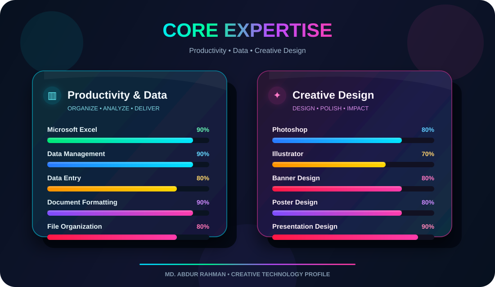
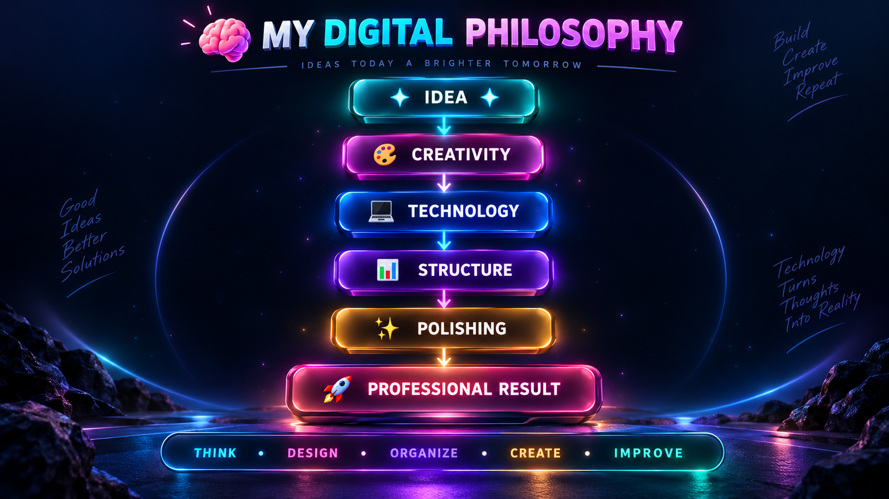

<div align="center">


<br>

<a href="https://github.com/rahman-q-gen">

</a>

<a href="mailto:md.abdur.rahman.career@gmail.com">

</a>


<br><br>


</div>

<br>

---

<div align="center">

# ✦ WELCOME TO MY DIGITAL SPACE ✦

### `CREATIVITY × TECHNOLOGY × ORGANIZATION`

</div>

<br>

<table>
<tr>
<td width="58%" valign="top">

## 👋 Hello, I'm MD. ABDUR RAHMAN

I am an **IT Professional, Graphic Designer, and Data Management Specialist** who enjoys combining technology, creativity, and organization to create polished digital solutions.

My professional interests include:

✦ Microsoft Office & productivity  
✦ Data entry and data management  
✦ Document formatting and processing  
✦ Graphic and visual design  
✦ PowerPoint presentation design  
✦ Photoshop and Illustrator  
✦ Computer and digital solutions  
✦ Structured workflow development  

I enjoy transforming raw information and ideas into work that is **organized, professional, attractive, and practical**.

### 🎯 My Vision

> **Create smart digital solutions where professional design meets productivity.**

</td>

<td width="42%" align="center">

<br>


<br><br>


</td>
</tr>
</table>

<br>

---

<div align="center">

# ◈ PROFESSIONAL IDENTITY ◈

</div>

<table>
<tr>

<td width="25%" align="center">
<br>
<h2>💻</h2>
<h3>IT</h3>
<b>Professional</b>
<br><br>
Computer Operations<br>
Digital Solutions<br>
Technical Workflow
<br><br>
</td>

<td width="25%" align="center">
<br>
<h2>📊</h2>
<h3>DATA</h3>
<b>Specialist</b>
<br><br>
Excel<br>
Data Entry<br>
Data Management
<br><br>
</td>

<td width="25%" align="center">
<br>
<h2>🎨</h2>
<h3>DESIGN</h3>
<b>Creative</b>
<br><br>
Photoshop<br>
Illustrator<br>
Visual Content
<br><br>
</td>

<td width="25%" align="center">
<br>
<h2>📽️</h2>
<h3>OFFICE</h3>
<b>Productivity</b>
<br><br>
Word<br>
PowerPoint<br>
Formatting
<br><br>
</td>

</tr>
</table>

<br>

---

<div align="center">

# 🛠️ MY CREATIVE TOOLKIT

### ◆ Microsoft Productivity

<br>


<br><br>

### ◆ Creative Design

<br>


<br><br>

### ◆ Digital Workspace

<br>


</div>

<br>

---

<div align="center">

<div align="center">

## ✨ CORE EXPERTISE



</div>

</td>
</tr>
</table>

<br>

---

<div align="center">

# 💎 SERVICES I PROVIDE

</div>

<table>
<tr>
<td width="33%" align="center">

### 📝 DOCUMENTS

Professional Word Documents

Document Formatting

Editing & Cleanup

Reports & Structured Files

</td>

<td width="33%" align="center">

### 📊 DATA

Excel Data Management

Data Entry

Data Cleaning

Spreadsheet Organization

</td>

<td width="33%" align="center">

### 🎨 DESIGN

Banner Design

Poster Design

Image Editing

Creative Graphics

</td>
</tr>

<tr>
<td width="33%" align="center">

### 📽️ PRESENTATION

PowerPoint Design

Professional Slides

Academic Presentations

Business Presentations

</td>

<td width="33%" align="center">

### 🗂️ MANAGEMENT

File Organization

Document Processing

Structured Workflow

Digital Records

</td>

<td width="33%" align="center">

### 💻 IT SOLUTIONS

Computer Operations

Digital Productivity

Web & Internet Tools

General IT Support

</td>
</tr>
</table>

<br>

---

<div align="center">

# 🚀 FEATURED PROJECT

## 📘 LMS QUESTION BANK CONVERTER

### `SMART MCQ → LMS CSV WORKFLOW`

</div>

<table>
<tr>
<td width="58%" valign="top">

### 💡 Project Overview

A specialized workflow designed to convert **MCQ Question Banks** into structured, clean, and **LMS-compatible CSV files**.

It is designed to make academic question-bank preparation faster and easier while maintaining proper formatting.

### ⚡ Core Features

* ✅ MCQ Question Conversion
* ✅ LMS-Compatible CSV Output
* ✅ Mathematical Notation Support
* ✅ LaTeX Equation Support
* ✅ Structured Question Formatting
* ✅ Answer Organization
* ✅ Bulk Processing
* ✅ Efficient Question Management

</td>

<td width="42%" align="center">

<br>

### 🎯 WORKFLOW

```text
QUESTION BANK
     │
     ▼
MCQ PROCESSING
     │
     ▼
FORMATTING
     │
     ▼
CSV CONVERSION
     │
     ▼
LMS READY
```

</td>
</tr>
</table>

<br>

---

<div align="center">

# 🎨 CREATIVE PROJECTS

<br>


<br><br>

</div>

<table>
<tr>

<td width="50%" valign="top">

### ✦ Graphic Design

🎨 Banner Design
📢 Poster Design
📱 Social Media Graphics
🖼️ Image Editing
🖌️ Illustrator Artwork
✨ Promotional Graphics

</td>

<td width="50%" valign="top">

### ✦ Data & Document Projects

📊 Excel-Based Solutions
🧹 Data Cleaning
📑 Data Entry
🗂️ Document Processing
📈 Spreadsheet Formatting
📁 Structured Data Management

</td>

</tr>
</table>

<br>

---

<div align="center">

# 📊 GITHUB COMMAND CENTER

<br>


<br><br>


</div>

<br>

---

<div align="center">

# ⚡ CONTRIBUTION MATRIX


</div>

<br>

---

<div align="center">

# 🏆 ACHIEVEMENT WALL


</div>

<br>

---

<div align="center">

# 🌱 CURRENTLY LEVELING UP

</div>

<table>
<tr>

<td align="center" width="20%">

### 📊

**ADVANCED EXCEL**

<sub>Data • Formula • Reporting</sub>

</td>

<td align="center" width="20%">

### 🎨

**GRAPHIC DESIGN**

<sub>Creative Visuals</sub>

</td>

<td align="center" width="20%">

### 📽️

**PRESENTATION**

<sub>Premium Slide Design</sub>

</td>

<td align="center" width="20%">

### 💻

**IT SKILLS**

<sub>Digital Solutions</sub>

</td>

<td align="center" width="20%">

### 🌐

**WEB TECHNOLOGY**

<sub>Learning & Exploring</sub>

</td>

</tr>
</table>

<br>

---

<div align="center">

<br>

<div align="center">

<div align="center">

## 🧠 MY DIGITAL PHILOSOPHY


<br><br>



<br><br>


<br><br>


# 🌌 PROFESSIONAL MINDSET


<br>

### ✦ `CREATIVITY + TECHNOLOGY + CONSISTENCY = GROWTH` ✦

</div>

<br>

---

<div align="center">

# 🤝 LET'S CREATE SOMETHING AMAZING

<br>

<a href="mailto:[md.abdur.rahman.career@gmail.com](mailto:md.abdur.rahman.career@gmail.com)">

</a>

<a href="https://github.com/rahman-q-gen">

</a>

<br><br>


<br><br>

### 📧 `md.abdur.rahman.career@gmail.com`

### 💻 `github.com/rahman-q-gen`

<br>


<br>

### ⭐ `THANK YOU FOR VISITING` ⭐

<br>


</div>
```

